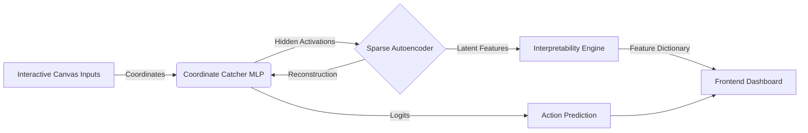

# NeuroScope: An Interpretability Observatory

NeuroScope is a modern, real-time interpretability observatory for analyzing and steering neural networks. Built on FastAPI, PyTorch, and Vanilla JS, it demystifies the "black box" of AI through interactive visualization, causal intervention, and feature inversion.

## 🌟 Key Features

* **Game Arena**: Interactive canvas to drag-and-drop the Agent and Target, generating inputs for the neural network. 
* **Live Training**: Watch the PyTorch model learn the coordinate navigation task in real-time.
* **Intervention Sandbox**: Prune base MLP neurons and visualize the causal logit shifts.
* **Decision Backtrace**: Trace outputs back through the Sparse Autoencoder (SAE) into human-readable concepts with interactive Sankey diagrams.
* **Feature Observatory**: Inspect the active latent dictionary features disentangled by the SAE.
* **Game-State Atlas**: Run gradient ascent (feature inversion) to "dream" the exact coordinates that maximize a specific SAE feature.

## 🏗️ Architecture



## 📁 Project Structure

```
.
├── app.py                 # FastAPI app: REST endpoints + WebSocket
├── neuroscope_engine.py    # PyTorch model, SAE, training/inference logic
├── requirements.txt
├── Procfile                # for Render / Railway / Heroku-style platforms
└── static/                  # ⚠️ frontend files MUST live here
    ├── index.html
    ├── app.js
    └── style.css
```

`app.py` serves the frontend via `StaticFiles(directory="static", html=True)` mounted at `/`.
**`index.html`, `app.js`, and `style.css` must be inside a `static/` folder** at the project
root — if they're placed at the repo root instead, `GET /` will 404.

## 🚀 Local Setup

**1. Clone and Install Dependencies**
Ensure you have Python 3.9+ installed.
```bash
pip install -r requirements.txt
```

**2. Run the FastAPI Server**
```bash
python -m uvicorn app:app --host 127.0.0.1 --port 8000 --reload
```

**3. Explore**
Open `http://127.0.0.1:8000` in your browser. Start by dragging the Agent around the Game Arena!

## ⚙️ Configuration

| Env Var          | Default | Description |
|-------------------|---------|--------------|
| `ALLOWED_ORIGINS` | `*`     | Comma-separated list of allowed CORS origins (e.g. `https://your-domain.com`). **Set this explicitly before deploying to production** — the default `*` is permissive and intended only for local development. |

## 🩺 Health Check

`GET /api/health` returns `{"status": "ok", "epoch": <int>}` and can be used by uptime
monitors, load balancers, or platform health probes (Render, Railway, etc).

## 📄 License

This project is licensed under the MIT License. See the `LICENSE` file for details.
